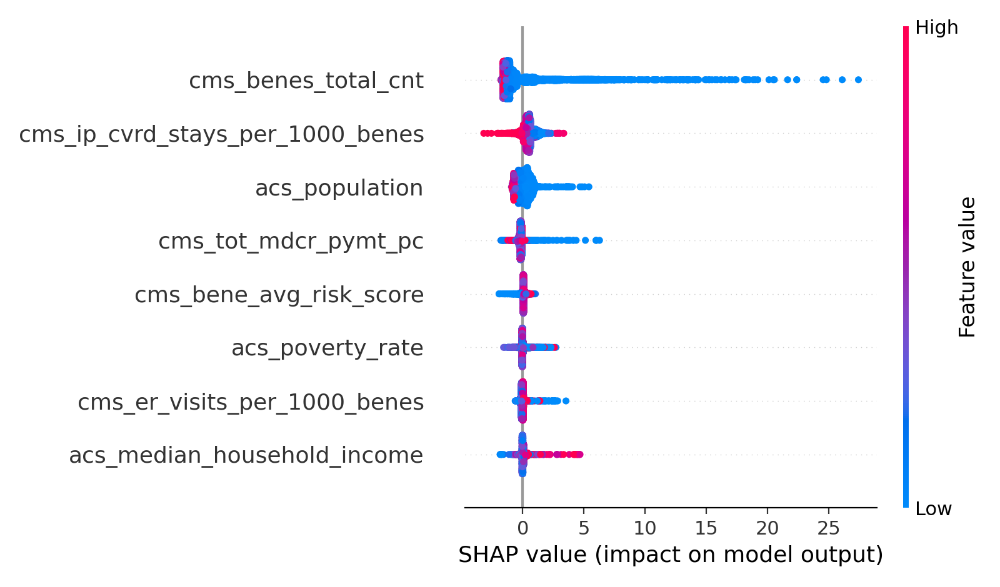

# Healthcare Cost Volatility Prediction Platform

## Executive Summary
Healthcare organizations struggle not only with high medical costs, but with **unpredictable cost behavior**. Sudden deviations in member spending introduce budgeting risk, reserve pressure, and reactive decision-making.

This project focuses on **predicting healthcare cost volatility** rather than total cost. The goal is to identify members whose future spending is likely to **deviate significantly from their historical cost patterns**, enabling earlier financial planning and targeted review.

The platform demonstrates an end-to-end applied machine learning workflow, including data generation, feature engineering, leakage-aware modeling, and decision-oriented risk scoring.

---

## Why Cost Volatility Instead of Cost Prediction
Traditional healthcare models focus on predicting absolute cost or utilization. While useful, these approaches often fail to capture **instability**, which is what most directly impacts financial planning and forecasting.

This project reframes the problem as:
- Who is likely to experience **unexpected cost changes**, not just high costs?
- Which members introduce **budget risk** due to spending volatility?

This framing aligns closely with the needs of:
- FP&A and budgeting teams  
- Medical economics and actuarial support  
- Strategic healthcare analytics  

---

## Problem Definition
The objective is to predict **future healthcare cost volatility at the geographic (county) level, with extensibility to member-level modeling** using historical, claims-like data.

Rather than modeling raw spend, the system estimates deviation from an individual’s **expected cost baseline** over time, capturing instability that may indicate emerging financial or care-related risk.

---

## Data Strategy (Synthetic + Public Real-World Data)

The project uses a hybrid data strategy that combines **synthetic data for prototyping** with **public, real-world healthcare datasets** for realistic modeling and validation.

### Public Data Sources
To ground the volatility framework in real healthcare behavior, the system integrates:

- **CMS Geographic Variation Public Use File**  
  County-level Medicare spending, utilization, and risk metrics (2014–2023), accessed programmatically via the CMS Public API.

- **American Community Survey (ACS 5-Year Estimates)**  
  County-level sociodemographic indicators including population, income, and poverty rates.

- **Bureau of Labor Statistics CPI (Annual)**  
  Macro-level inflation indicators to contextualize temporal cost changes.

All data sources are publicly available, privacy-safe, and reproducible.

### Synthetic Data Usage
Synthetic member-level data is retained for early experimentation and controlled stress-testing of volatility definitions. This enables rapid iteration without exposing sensitive information, while real-world datasets are used for downstream validation and benchmarking.

---

## System Overview
*A detailed pipeline diagram is under active revision and will be added in a future update.*

The current implementation follows a modular, batch-based workflow covering data ingestion, validation, feature engineering, leakage-aware modeling, and decision-oriented scoring.

---

## Real-World County-Level Volatility Modeling

To validate the volatility framework on real data, the project implements a county-year modeling pipeline using CMS, ACS, and CPI data.

### Target Definition
Volatility is defined as the **absolute year-over-year percentage change** in per-capita Medicare spending at the county level:

- Features at year *t* are used to predict volatility at year *t+1*
- End-of-series years are excluded to prevent target leakage

### Modeling Dataset
The final modeling table contains:

- ~28,000 county-year observations
- Coverage from 2014 to 2022
- Integrated healthcare utilization, risk, socioeconomic, and macroeconomic signals

## Explainability (SHAP)

To make the county-level volatility model interpretable, we compute SHAP values on the **test window (year ≥ 2021)** using the trained HistGradientBoostingRegressor.

### SHAP Summary Plot (Global Feature Effects)

### Global Feature Importance (CSV)
A ranked global importance table is saved here:
- `docs/figures/shap_importance_hgbr.csv`

### Baseline Results
A leakage-aware linear regression baseline achieves:

- Meaningful separation between high-volatility and average counties
- Strong lift in the top-risk decile compared to the overall population

These results establish a credible performance floor before introducing more complex models.

---

## Feature Engineering Approach
Features are designed to capture **change, instability, and deviation over time**, rather than static cost snapshots.

Key feature categories include:
- Rolling cost statistics (mean, standard deviation, quantiles) over multiple time windows  
- Member-relative spike indicators (cost exceeding historical percentiles)  
- Global spike indicators (absolute high-cost events)  
- Temporal variability and trend measures  

Early time periods without sufficient historical context are explicitly excluded from modeling to prevent artificial signal and target leakage.

---

## Label Design
The volatility problem is intentionally decomposed into **two complementary targets**, reflecting how real-world financial risk systems operate.

### 1. Spike Classification
A binary indicator representing whether a member experiences a cost spike relative to their historical behavior.

This answers:
> *“Is a volatility event likely to occur?”*

Member-relative and global thresholds are used to distinguish unexpected instability from consistently high-cost behavior.

---

### 2. Volatility Magnitude Regression
A continuous measure representing the **severity of instability** when it occurs.

This answers:
> *“How large could the deviation from expected cost be?”*

Separating event detection from magnitude estimation allows for clearer modeling, evaluation, and operational use.

---

## Modeling Approach
Simple, interpretable baseline models are used intentionally to establish credibility and transparency:

- **Logistic Regression** for spike classification  
- **Linear Regression** for volatility magnitude estimation  

Model selection prioritizes:
- Interpretability  
- Stability on noisy healthcare data  
- Ease of leakage detection and diagnosis  

This baseline-first approach ensures signal is understood before introducing additional complexity.

---

## Validation Strategy
Random train-test splits can leak future information in time-series healthcare data. To avoid this, the project uses **out-of-time validation**:

- Models are trained on earlier time periods  
- Performance is evaluated on later, unseen periods  

This mirrors real-world deployment, where models are trained on historical data and used to score future behavior.

---

##Model Explainability and Transparency
Healthcare financial models must support auditability and stakeholder trust. To ensure that volatility predictions are interpretable and defensible, the project incorporates post-hoc model explainability using SHAP (SHapley Additive Explanations).

SHAP values are used to quantify the marginal contribution of each feature to the predicted volatility for a given county-year observation. This enables both global and local interpretability, helping answer questions such as which factors most strongly drive volatility risk across counties and why a specific county was flagged as high risk in a given year.

At the global level, SHAP analysis consistently highlights prior per-capita spending, utilization intensity, and population-adjusted utilization rates as the primary drivers of future volatility. Socioeconomic variables such as median household income and poverty rate provide secondary context, particularly in counties with structurally constrained access patterns.

At the local level, SHAP explanations support case-by-case analysis, enabling analysts to understand why a county’s risk score changed over time. This design aligns with real-world healthcare and financial analytics requirements, where model outputs must be explainable, reviewable, and suitable for governance and decision support rather than opaque prediction alone.

Explainability artifacts are generated as part of the modeling workflow and can be reproduced consistently as data sources or models evolve.

---

## Leakage Detection and Mitigation
During development, unusually perfect model performance triggered further investigation.

Correlation analysis revealed that some rolling statistics used as features were direct proxies for the volatility labels, introducing target leakage.

Corrective actions included:
- Removing label-derived features  
- Re-training models  
- Accepting lower but honest performance  

This process reflects real-world ML practice, where detecting and fixing leakage is critical for trustworthiness.

---

## Financial Volatility Index (FVI)
To support decision-making, probability and impact are combined into a single risk score:

**FVI = P(Spike) × Expected Volatility**

This produces a rankable signal that balances:
- Likelihood of instability  
- Financial severity if instability occurs  

Members are segmented into Low, Medium, and High volatility tiers based on capacity-aware thresholds, enabling practical prioritization.

---

## Evaluation Philosophy
Healthcare cost data is inherently noisy, and point-accuracy metrics alone are insufficient.

Evaluation focuses on:
- Lift and concentration of events in high-risk segments  
- Stability of risk rankings over time  
- Practical usefulness for monitoring and planning  

The goal is **decision support**, not exact dollar prediction.

---

## Design Considerations
The project is structured to support future extension, including:
- Alternative volatility definitions  
- Model replacement or retraining  
- Integration of additional signals (e.g., utilization detail, pharmacy, administrative events)  

The emphasis is on modularity, reproducibility, and clarity rather than overengineering.

---

## Limitations and Future Work
- Synthetic data cannot capture all clinical and operational nuance  
- Volatility is influenced by administrative and external factors not modeled here  
- Future iterations could incorporate richer signals, monitoring logic, and retraining cadence  

---

## Key Takeaways
- Cost volatility is distinct from cost magnitude and represents a critical financial risk signal  
- Leakage-aware feature and label design is essential in healthcare ML  
- Simple, interpretable models can deliver meaningful, decision-ready insights  

